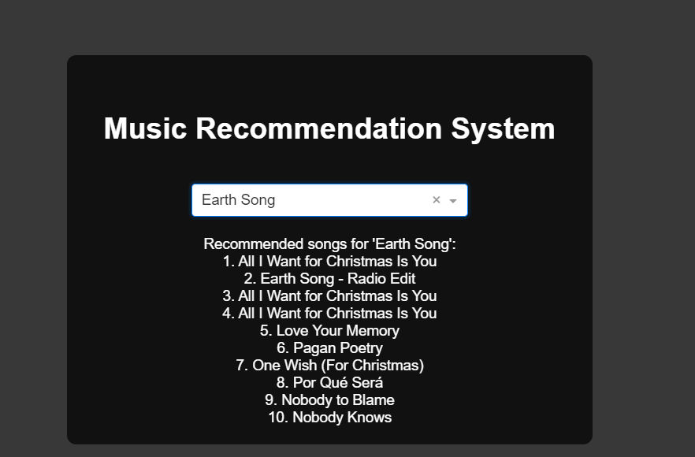
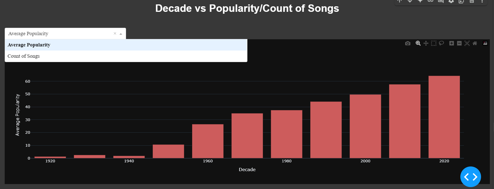

# 🎵 Music Recommendation System


📝This project was inspired from **Spotify**. I've used **Content-based Filtering** method for this Recommendation system.


## Appendix

There are 3 types of recommendation systems available.
 - [Content-based filtering](https://www.geeksforgeeks.org/what-are-recommender-systems/)
 - [Collaborative filtering](https://www.geeksforgeeks.org/what-are-recommender-systems/)
 - [Hybrid systems](https://www.geeksforgeeks.org/what-are-recommender-systems/)

Here I used Content-based filtering for the system. 

## 📂 Project Structure

```
📁 Music-Recommendation-System
│── 📄 README.md
│── 📂 dataset/          # Dataset files
│── 📂 src/              # Source code
│── 📄 app.py           # Main application file
│── 📄 requirements.txt  # Dependencies
│── 📂 screenshots/      # Output images
```

---


## 🛠 Installation & Usage

### 1️⃣ Install Dependencies
```bash
pip install -r requirements.txt
```

### 2️⃣ Run the Application
```bash
python app.py
```

    
## Features
- Exploratory Data Analysis of the dataset.
- Interacive dashboard.
- Recommendations of a selected song.
- Top 10 Recommendations.


## Optimizations

For optimizations I've used 
- **StandardScaler** ,
- **PCA** ,
- **Sparse Matrix**.


## Screenshots





## 📌 Future Improvements

- Add more filtering options 🔍
- Enhance UI with better visuals 🎨
- Improve recommendation accuracy 📡
- Integrate with Spotify API 🎼

---


## Authors

- [@Mahir-Faysal](https://github.com/Mahir-Faysal)

